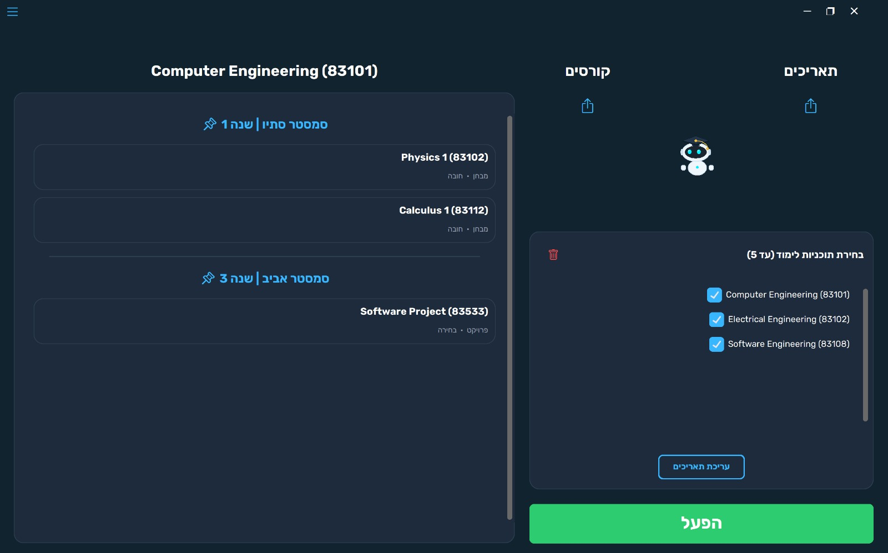
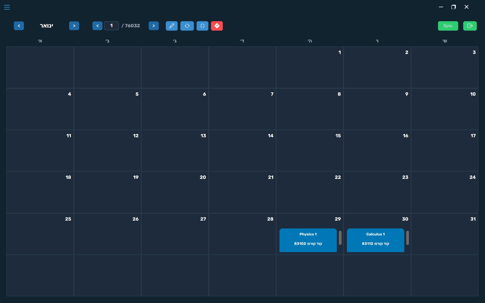
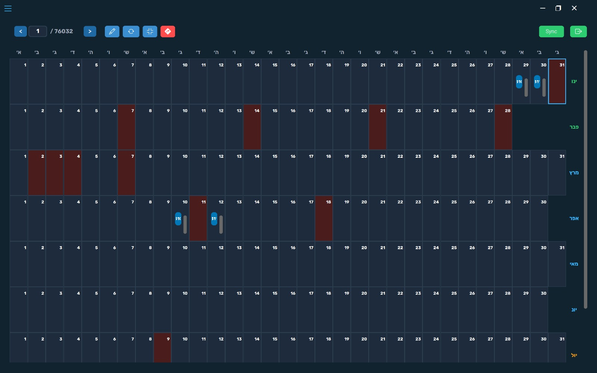
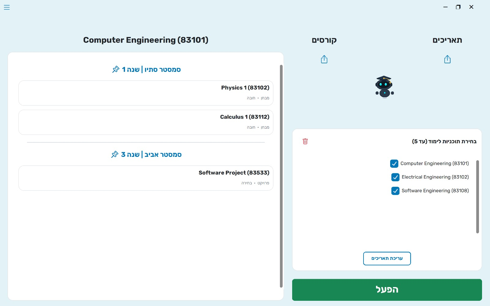
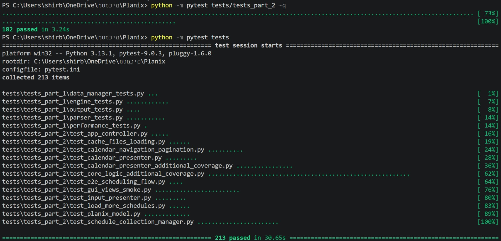

# Planix

GitHub repository: 

https://github.com/shirbenhamu/Planix.git

Jira Project Management:

https://shirbenhamo.atlassian.net/jira/software/projects/PLAN/boards/69?atlOrigin=eyJpIjoiNjYwMDQ0NDEyMjc5NDQwZTllNGM4ZmRhMmE4ZDc5ZmIiLCJwIjoiaiJ9

Presentation:

[https://canva.link/tz751xhsp8qb7r7](https://canva.link/0gfho7y1n4ir21z)

UML Class diagram: In Folder "diagrams".

## Description

Planix is an advanced exam scheduling system designed to help engineering faculties efficiently generate, evaluate, and manage examination timetables while satisfying complex academic constraints. 

Version 34.0 extends the scheduling engine with advanced optimization capabilities, Advanced Scheduling Constraints, Schedule Ranking & Quality Metrics, manual schedule editing, intelligent ranking mechanisms, holiday-aware scheduling, and external calendar integration. The system provides both a command-line interface and a GUI application, allowing users to generate, compare, modify, and export high-quality exam schedules.

## Main Features

**Advanced Scheduling Constraints -** Users can define additional scheduling constraints, including minimum gap between mandatory exams, minimum gap between all exams within the same academic program, maximum number of elective exam conflicts, maximum examination span for mandatory courses, maximum number of exams scheduled on the same day.

**Schedule Ranking & Quality Metrics -** Every generated schedule is evaluated using multiple quality metrics. Users can sort schedules according to one or more ranking criteria, allowing them to identify the most balanced examination timetable.

**Deep Search Optimization -** Planix introduces a background optimization engine capable of exploring a significantly larger solution space. During execution, the system continuously searches for better schedules while maintaining only the highest-ranked results in memory.

**Manual Schedule Editing -** Users can manually move exams using drag-and-drop. Every modification is validated against all scheduling constraints before being accepted, ensuring that manually edited schedules remain valid.

**Holiday-Aware Scheduling -** Users may select one or more religions before schedule generation. The system automatically retrieves official holiday dates and prevents exams from being scheduled on those days.

**Export Options -** Selected schedules can be exported either as text files, or standard iCalendar (.ics) files compatible with Google Calendar, Outlook, Apple Calendar, and other calendar applications.

**Flexible Calendar Views -** Schedules can be displayed using monthly and yearly calendar views for improved visualization.

**Multi-Language Support -** The application supports both Hebrew and English user interfaces.

**Dark Mode & Light Mode -** Day and night themes improve accessibility and user comfort.

**Dual Interface Support (GUI & CLI) -** planix supports both a modern Graphical User Interface (GUI) and a Command-Line Interface (CLI).

**Color-Coded Calendar Visualization -** The calendar provides a clear visual distinction between exam types. Mandatory course exams are displayed in one color, while elective course exams are displayed in a different color, allowing users to quickly identify the nature of each exam and better understand the overall schedule at a glance.

## Technical Highlights

**MVP Architecture (Model–View–Presenter) -** The software is built using the MVP architecture to reduce coupling between components, improving separation of concerns, maintainability, and testability.

**Advanced Scheduling Engine -** Version 4.0 introduces an extended scheduling engine capable of validating advanced constraints during schedule generation while maintaining high performance.

**Multi-Process Background Execution -** Computationally intensive scheduling operations execute in separate background processes, keeping the graphical interface fully responsive throughout schedule generation.

**Quality Metrics Engine -** Each generated schedule is automatically evaluated using multiple quality metrics without requiring additional schedule analysis.

**Efficient Result Management -** Schedules are indexed rather than fully loaded into memory, allowing efficient sorting and browsing of large result sets with minimal memory usage.

**Persistent Internal Caching -** The application maintains an internal cache while it is running, enabling fast data reloading and minimizing unnecessary file I/O operations. This supports efficient Persistent Internal Data Handling and improves overall performance.

**Responsive Performance -** The system is optimized to provide fast and responsive user interaction without noticeable delays.

**Scalable System Design -** The architecture is designed to support future feature expansions and additional scheduling functionalities.

**Agile Development Workflow -** The project is managed using Agile methodologies alongside Git version control and Jira task management systems.

## Launching
| Command | Description | 
|---|---|
|`pip install -r requirements.txt` |Install Dependencies|
|`python -m src.main` |Run the GUI version|
|`   ` |Run the file-based version|
|`python -m pytest tests/tests_part_3 -q` |Run version 3.0 tests|
|`python -m pytest tests/tests_part_4 -q` |Run version 4.0 tests|
|`python -m pytest tests` |Run all the tests|

## Running Example

**Constraint Selection**

**Sort Order Selection**

**Manual Edit Feature**

**Calendar Export**

**Religious Exclusions**

**Advanced Search**

**file-based version (CLI)**

**Running the tests**

