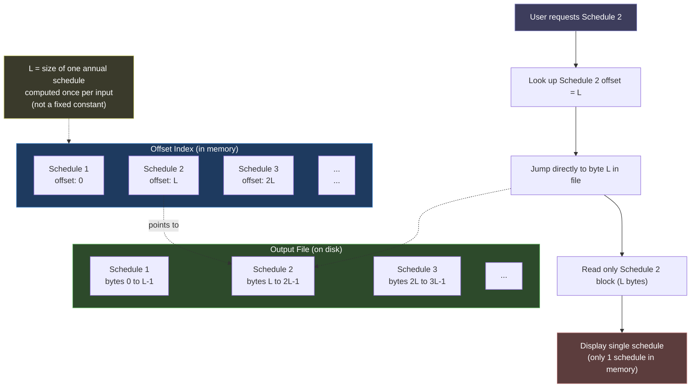

# Byte Offset Indexing

```mermaid
flowchart TB
    subgraph INDEX["Offset Index (in memory)"]
        direction LR
        I1["Schedule 1<br/>offset: 0"]
        I2["Schedule 2<br/>offset: L"]
        I3["Schedule 3<br/>offset: 2L"]
        I4["...<br/>..."]
    end

    NOTE["L = size of one annual schedule<br/>computed once per input<br/>(not a fixed constant)"]

    subgraph FILE["Output File (on disk)"]
        direction LR
        B1["Schedule 1<br/>bytes 0 to L-1"]
        B2["Schedule 2<br/>bytes L to 2L-1"]
        B3["Schedule 3<br/>bytes 2L to 3L-1"]
        B4["..."]
    end

    USER["User requests Schedule 2"] --> LOOKUP["Look up Schedule 2 offset = L"]
    LOOKUP --> JUMP["Jump directly to byte L in file"]
    JUMP --> READ["Read only Schedule 2 block (L bytes)"]
    READ --> SHOW["Display single schedule<br/>(only 1 schedule in memory)"]

    NOTE -.-> INDEX
    I2 -.->|points to| B2
    JUMP -.-> B2

    style INDEX fill:#1e3a5f,stroke:#4a90d9,color:#fff
    style FILE fill:#2d4a2b,stroke:#5cb85c,color:#fff
    style USER fill:#3d3d5c,stroke:#8888cc,color:#fff
    style SHOW fill:#5c3d3d,stroke:#cc8888,color:#fff
    style NOTE fill:#3a3a2b,stroke:#cccc66,color:#fff
```