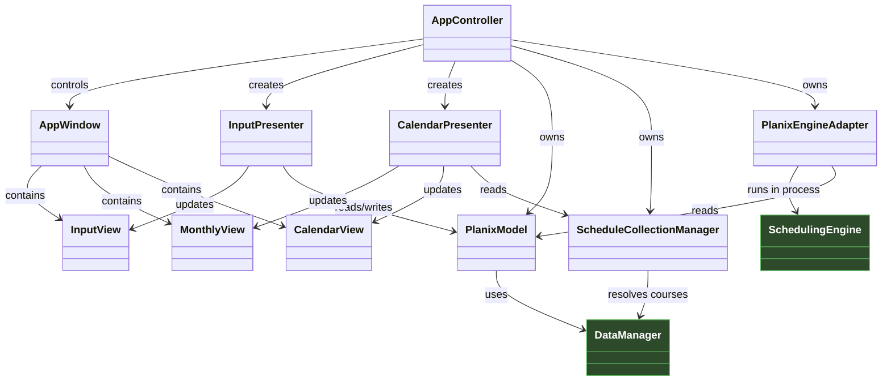

# UML Class Diagram - UI Layer

```mermaid
classDiagram
    class AppWindow
    class AppController
    class InputPresenter
    class CalendarPresenter
    class InputView
    class MonthlyView
    class CalendarView
    class PlanixModel
    class ScheduleCollectionManager
    class PlanixEngineAdapter
    class DataManager
    class SchedulingEngine

    AppController --> AppWindow : controls
    AppController --> InputPresenter : creates
    AppController --> CalendarPresenter : creates
    AppController --> PlanixModel : owns
    AppController --> ScheduleCollectionManager : owns
    AppController --> PlanixEngineAdapter : owns

    AppWindow --> InputView : contains
    AppWindow --> MonthlyView : contains
    AppWindow --> CalendarView : contains

    InputPresenter --> InputView : updates
    InputPresenter --> PlanixModel : reads/writes
    CalendarPresenter --> MonthlyView : updates
    CalendarPresenter --> CalendarView : updates
    CalendarPresenter --> ScheduleCollectionManager : reads

    PlanixModel --> DataManager : uses
    PlanixEngineAdapter --> SchedulingEngine : runs in process
    PlanixEngineAdapter --> PlanixModel : reads
    ScheduleCollectionManager --> DataManager : resolves courses

    class DataManager:::core
    class SchedulingEngine:::core

    classDef core fill:#2d4a2b,stroke:#5cb85c,color:#fff
```