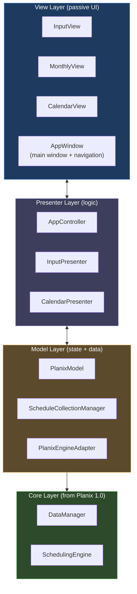

# Component Diagram - MVP Layers

```mermaid
flowchart TB
    subgraph VIEW["View Layer (passive UI)"]
        direction LR
        IV["InputView"]
        MV["MonthlyView"]
        CV["CalendarView"]
        AW["AppWindow<br/>(main window + navigation)"]
    end

    subgraph PRES["Presenter Layer (logic)"]
        direction LR
        AC["AppController"]
        IP["InputPresenter"]
        CP["CalendarPresenter"]
    end

    subgraph MODEL["Model Layer (state + data)"]
        direction LR
        PM["PlanixModel"]
        SCM["ScheduleCollectionManager"]
        EA["PlanixEngineAdapter"]
    end

    subgraph CORE["Core Layer (from Planix 1.0)"]
        direction LR
        DM["DataManager"]
        ENG["SchedulingEngine"]
    end

    VIEW <--> PRES
    PRES <--> MODEL
    MODEL --> CORE

    style VIEW fill:#1e3a5f,stroke:#4a90d9,color:#fff
    style PRES fill:#3d3d5c,stroke:#8888cc,color:#fff
    style MODEL fill:#5c4a2d,stroke:#d9a84a,color:#fff
    style CORE fill:#2d4a2b,stroke:#5cb85c,color:#fff
```