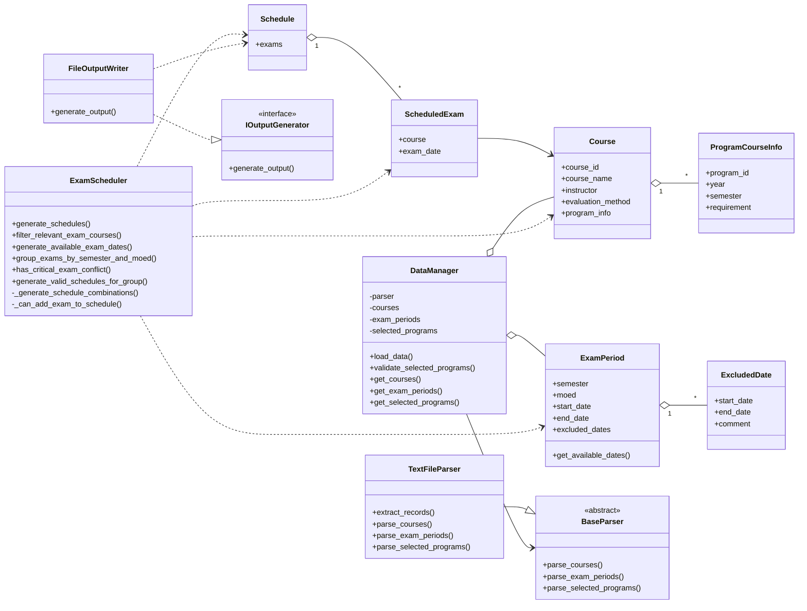

```mermaid
%%{init: {'themeVariables': {'fontSize': '13px'}}}%%
classDiagram
direction LR

class Course {
    +course_id
    +course_name
    +instructor
    +evaluation_method
    +program_info
}

class ProgramCourseInfo {
    +program_id
    +year
    +semester
    +requirement
}

class ExamPeriod {
    +semester
    +moed
    +start_date
    +end_date
    +excluded_dates
    +get_available_dates()
}

class ExcludedDate {
    +start_date
    +end_date
    +comment
}

class Schedule {
    +exams
}

class ScheduledExam {
    +course
    +exam_date
}

class BaseParser {
    <<abstract>>
    +parse_courses()
    +parse_exam_periods()
    +parse_selected_programs()
}

class TextFileParser {
    +extract_records()
    +parse_courses()
    +parse_exam_periods()
    +parse_selected_programs()
}

class DataManager {
    -parser
    -courses
    -exam_periods
    -selected_programs
    +load_data()
    +validate_selected_programs()
    +get_courses()
    +get_exam_periods()
    +get_selected_programs()
}

class ExamScheduler {
    +generate_schedules()
    +filter_relevant_exam_courses()
    +generate_available_exam_dates()
    +group_exams_by_semester_and_moed()
    +has_critical_exam_conflict()
    +generate_valid_schedules_for_group()
    -_generate_schedule_combinations()
    -_can_add_exam_to_schedule()
}

class IOutputGenerator {
    <<interface>>
    +generate_output()
}

class FileOutputWriter {
    +generate_output()
}

Course "1" o-- "*" ProgramCourseInfo
ExamPeriod "1" o-- "*" ExcludedDate
Schedule "1" o-- "*" ScheduledExam
ScheduledExam --> Course

TextFileParser --|> BaseParser
DataManager --> BaseParser
DataManager o-- Course
DataManager o-- ExamPeriod

ExamScheduler ..> Course
ExamScheduler ..> ExamPeriod
ExamScheduler ..> Schedule
ExamScheduler ..> ScheduledExam

FileOutputWriter ..|> IOutputGenerator
FileOutputWriter ..> Schedule
```